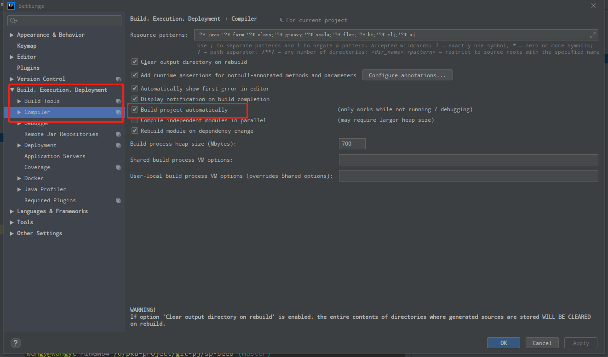
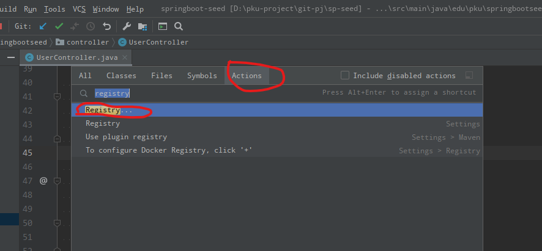
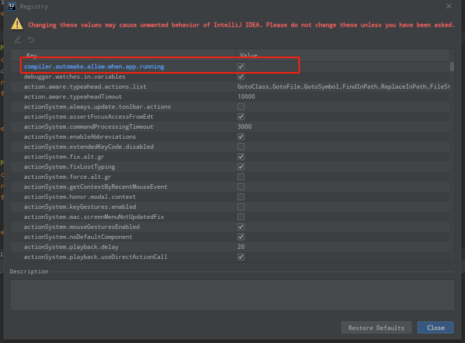
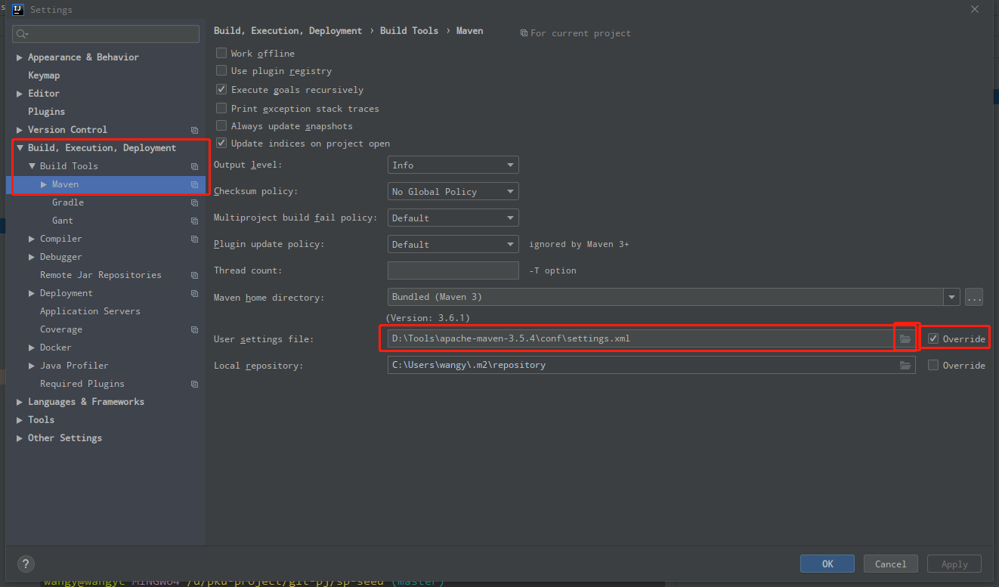
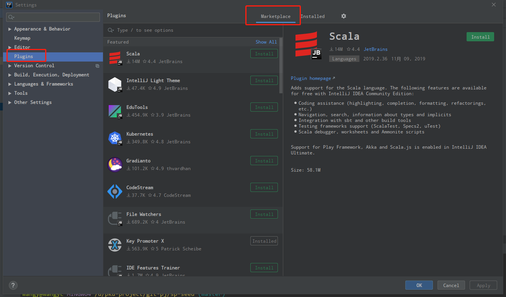
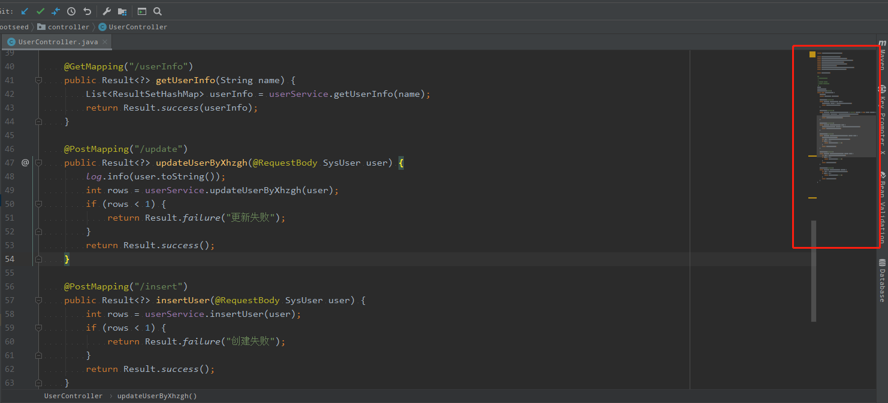

## IDE 下载

下载网站 <https://www.jetbrains.com/idea/download/#section=windows>，下载时选择 Ultimate 版本。

IntelliJ IDEA 对教育邮箱免费，可以用学校邮箱在 <https://account.jetbrains.com/login> 注册账户，注册账户后在 IntelliJ IDEA 的 Help->Register 菜单中对软件授权。

## IDE 配置

### 配置热加载

如果希望使用 Spring Boot 的热加载功能需要在 Intellij 中配置实时编译，配置过程如下：

1、设置自动编译，勾选 `Build project automatically`。



2、点击菜单 Help->Find Action，在弹出框中输入 `registry`，然后点击出现的第一个选项 `registry...`。



3、在 Registry 弹出框中找到 `compiler.automake.allow.when.app.running` 选项，并勾选。



### 配置Maven

Intellij 中默认集成了 Maven，但是默认 Maven 的下载源是国外，可以将 Maven 的下载源改为国内，以此提高下载速度。设置过程如下：

1、 在本地创建文件 `settings.xml`，路径没有要求，可以为 `C:\Users\youname`，并将下面的代码粘贴到文件中。

```xml
<?xml version="1.0" encoding="UTF-8"?>

<settings xmlns="http://maven.apache.org/SETTINGS/1.0.0" 
  xmlns:xsi="http://www.w3.org/2001/XMLSchema-instance" xsi:schemaLocation="http://maven.apache.org/SETTINGS/1.0.0 http://maven.apache.org/xsd/settings-1.0.0.xsd">
  <mirrors>
    <mirror>
      <id>AliMaven</id>
      <name>aliyun maven</name>
      <url>http://maven.aliyun.com/nexus/content/groups/public/</url>
      <mirrorOf>central</mirrorOf>
    </mirror>
  </mirrors>
</settings>
```

2、 在 Intellij 中使用该文件覆盖 Maven 的配置。注意在设置时要先勾选 `Override`，再点击左侧文件夹图标选择本地的 `settings.xml` 文件。



## IDE 插件推荐

查找插件和安装插件如下图：



### CodeGlance

安装该插件后，编辑器的右侧会出现代码的缩略图（minimap），帮助快速定位当前所在的位置。


### Eclipse Keymap

如果习惯了 Eclipse 的快捷键，可以安装该插件将 Intellij 的默认快捷键修改为 Eclipse 的快捷键。

### MyBatisCodeHelperPro （不使用MyBatis的xml文件时，无需该插件）

该插件是收费的，但是也提供了免费的功能，帮助快速在 MyBatis Mapper 和 XML 文件中跳转。收费版的功能提供了 Code Generager，可以一键生成基于xml的增删改查。

### Lombok <https://projectlombok.org/>

Lombok 用于简化 Java 代码，可以通过注解的方式减少很多重复代码。如果项目中使用了 lombok 必须安装此插件。